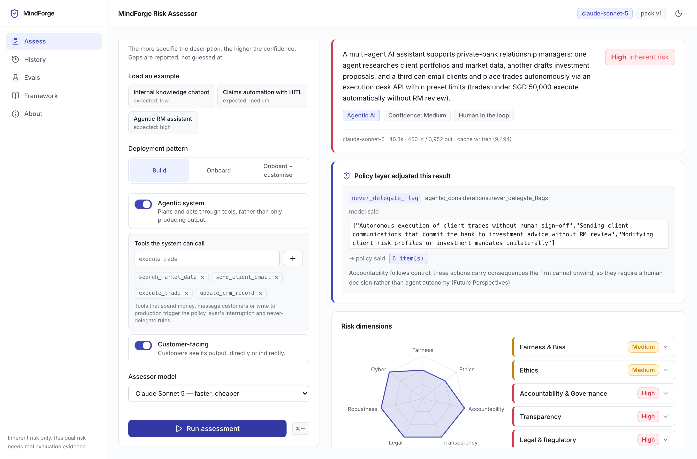
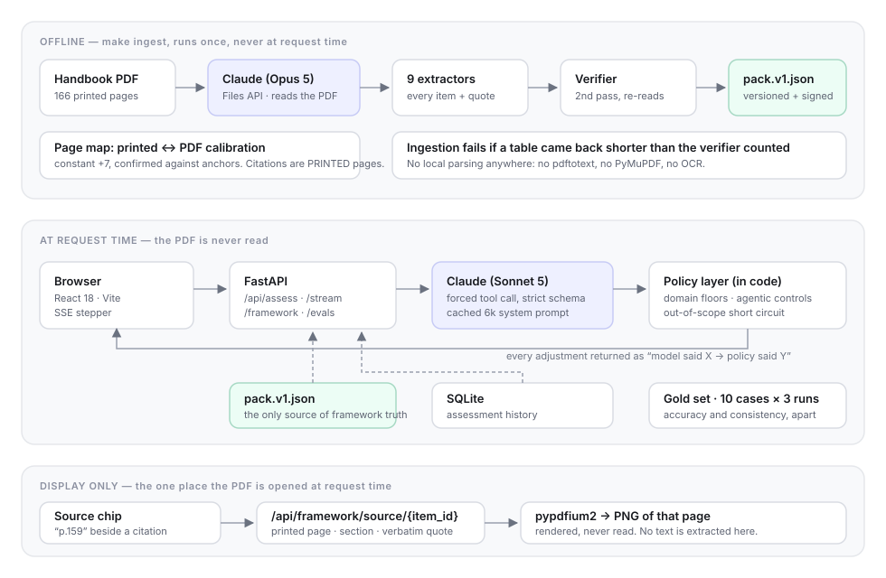

# MindForge AI Risk Materiality Assessment Tool

Describe an AI use case in plain English; get it classified against the **MindForge AI
Risk Management Operationalisation Handbook** (The MindForge Consortium, January 2026) —
scope under Section 1.1, every Section 2.4 materiality factor rated, an inherent risk
tier, the seven Appendix B dimensions, an oversight mode, and guardrails, metrics and
Considerations drawn from the handbook's own libraries.

Every citation can be opened to the page it came from.



---

## Quick start

Requires Python 3.11+, Node 20+, and an Anthropic API key.

```bash
cp backend/.env.example backend/.env   # then add your ANTHROPIC_API_KEY
make venv                              # virtualenv + backend install
make dev                               # API on :8000, front end on :5173
```

The framework pack is committed, so the app runs immediately. You do **not** need the
handbook PDF to use it — only to re-run ingestion, or to see a cited page rendered in the
source sheet.

```bash
make check     # ruff, mypy, prettier, eslint, and both test suites
make evals     # the gold set against Sonnet 5 (paid API calls, ~$1, ~9 min)
make ingest    # rebuild the pack from the PDF; skipped if it is already current
```

`make help` lists every target.

## Three decisions that shape everything

**1. The handbook is read once, offline, by Claude — never at request time.**
Nothing local parses the PDF: no pdftotext, no PyMuPDF, no OCR. Claude reads it through
the Files API, nine extractors pull out the framework, a second pass re-reads the same
pages to check every quote, and the result is frozen into a versioned pack
(`backend/framework/pack.v1.json`). The assessor, the API and the Framework page read the
pack. Ingestion fails if an appendix table comes back shorter than the verifier counted,
which is how silently dropped rows get caught.

Every extracted item carries the **printed** page number — the one on the paper, not the
PDF's index. The offset here is a constant +7, derived and then confirmed against anchors.

**2. The conservative defaults live in code, not in the prompt.**
A prompt instruction is a request; these rules have to hold on the runs where the model is
wrong, which is exactly when an instruction has already failed. `policy.py` floors inherent
risk at high for credit, insurance underwriting, employment, biometrics and autonomous
transactions; requires interruption controls and never-delegate boundaries for agents with
consequential tools; and withholds the whole risk analysis for systems that are not AI under
Section 1.1. Nothing is rewritten silently — each adjustment comes back as *"the model said
X, the policy layer said Y"* with its reason.

**3. It assesses inherent risk, and says so.**
Risk before controls. A described control does not lower a rating, because under Figure
2.4.3 controls bear on *residual* risk, and residual risk needs real evaluation evidence
that a paragraph cannot provide.

## Is it any good?

Ten hand-written use cases, three runs each, graded only on what the handbook settles.
Latest run:

| | `claude-sonnet-5` | `claude-opus-5` |
| --- | --- | --- |
| Overall check accuracy | **99.4%** (168 assertions) | 97.6% |
| Inherent tier exactly right | 96% | 93% |
| Dimension floors met | 100% | 100% |
| Run-to-run tier agreement | 97% | 97% |
| Median latency | 31.9s | 43.0s |
| Cost per assessment | $0.032 | $0.105 |

The harness earns its keep: on its first run it found three defects manual testing had
missed — six of seven risk dimensions silently going missing, responses truncated at
`max_tokens` being read as valid, and computer vision classified as generative AI. See
[docs/EVALS.md](docs/EVALS.md) for the method and what it caught.

## Layout

```
backend/
  src/mindforge_assess/
    assessor.py       one request, forced tool call, then the policy layer
    policy.py         the conservative defaults, in code and unit-tested
    schema.py         the single tool; strict, and ordered so factors precede the tier
    source.py         the only place the PDF is opened at request time (to draw it)
    ingest/           the offline pipeline: page map, 9 extractors, verifier, pack build
    evals/            gold set loader, scoring, runner, reports
    prompts/          the prompt generator and the rendered prompt that actually runs
  framework/          pack.v1.json, its JSON schema, and the verification report
  evals/              gold.jsonl and results/<model>/<timestamp>.{json,md}
  tests/              175 tests; none of them touch the network
frontend/             Vite + React 18 + TypeScript + Tailwind v4
docs/                 EVALS.md, PROMPT_DESIGN.md, FRAMEWORK_NOTES.md, architecture.svg
```



## API

| Route | |
| --- | --- |
| `POST /api/assess` | Assess one use case. |
| `POST /api/assess/stream` | The same, as SSE: `status` steps read off the model's own output, then one `result`. |
| `GET /api/assessments`, `/{id}` | History. |
| `GET /api/framework` | The whole pack. |
| `GET /api/framework/index` | Name → citable id, for turning an answer's names back into citations. |
| `GET /api/framework/source/{item_id}` | Printed page, section and verbatim quote. |
| `GET /api/framework/source/{item_id}/page.png` | That page, rendered server-side **for display only**. |
| `GET /api/framework/provenance` | What produced the pack, and how it verified. |
| `GET /api/evals/latest`, `POST /api/evals/run`, `GET /api/evals/status` | Eval results, and triggering a run. |
| `GET /api/health` | Key present, pack loaded, model in use. |

## Docker

```bash
cp backend/.env.example backend/.env    # add your key
docker compose up --build               # http://localhost:8000
```

One container, one port: the built front end is served by FastAPI, so there is no CORS in
play and no second process. History persists on a named volume. The handbook is mounted
read-only and is optional — without it, citations still resolve, only the page image is
unavailable.

## Notes on the API itself

Things verified against the docs rather than assumed, because each one changed the design:

- **`temperature` returns a 400** on Sonnet 5 and Opus 5. There is no sampling knob to pin,
  so the schema and forced `tool_choice` are the only constraints on the answer's shape —
  and run-to-run variance is measured rather than assumed away.
- **Forced tool choice works with *adaptive* thinking**; the incompatibility applies to
  manual thinking. `budget_tokens` is also a 400; depth is `output_config.effort`.
- **A strict schema will not accept `minItems` above 1**, so the seven risk dimensions are
  fixed object keys rather than a list. Their named risks live in a separate flat array
  because seven nested arrays exceed the compiled-grammar size limit.
- **A streamed tool input is reassembled by a tolerant parser**, so a response cut off at
  `max_tokens` returns a plausible-but-wrong dict instead of raising. The stop reason is
  checked before the input is read.

## Limits

- One handbook, one pack version. A new edition needs `make ingest --force`.
- Assessment quality is bounded by the description. The tool reports what it was not told
  rather than guessing, and caps its own confidence accordingly.
- The eval set is ten cases. It is a calibration instrument, not a certification.
